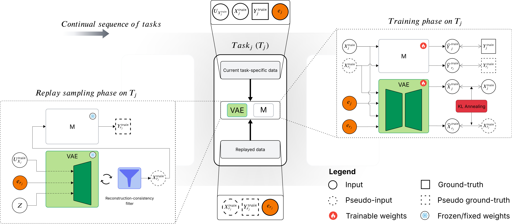

Oficial implementation for the paper:

# "Scene-conditioned generative replay for continual pedestrian trajectory prediction: an exploration across heterogeneous urban scenarios"

By Matheus V. V. Berto, Markus Geisler, and Tiago A. Almeida.

<p align="center">
  
</p>
<p align="center">
  <em>Overview of the proposed framework.</em>
</p>

<details>
<summary><h2>🧭​ Table of contents</h2></summary>

* [Abstract](#abstract)
* [Key contributions](#key-contributions)
* [Installation](#installation)
* [Usage](#usage)
* [Acknowledgments](#acknowledgments)
* [BibTeX](#bibtex)
* [Complete work](#complete-work)
* [References](#references)

</details>

## <a name="abstract"></a>📜 Abstract
Continual learning enables pedestrian trajectory predictors to adapt across evolving sensing environments. Although generative replay can mitigate catastrophic forgetting without retaining complete historical trajectory datasets, its effectiveness depends on the quality of generated pseudo-experiences. In this work, we extend continual pedestrian trajectory learning with social generative replay through three complementary mechanisms: (i) automatic scene conditioning through fixed visual representations extracted by a multimodal large language model; (ii) cyclical Kullback-Leibler annealing to promote latent-space utilization; and (iii) a lightweight reconstruction-consistency filter that rejects inconsistent pseudo-trajectories before replay. Experiments on five heterogeneous pedestrian trajectory datasets show prediction accuracy comparable to strong replay and no-replay baselines. Further analyses indicate improved alignment between generated replay and historical trajectory distributions, as well as reduced prediction error and forgetting under different task orders relative to the CL-SGR baseline. Overall, scene-conditioned generative replay improves alignment with historical trajectory distributions and reduces sensitivity to task ordering, while the benefits remain dependent on the encountered domains and the prediction architecture.

## <a name="key-contributions"></a>💡​ Key contributions
* We investigate scene conditioning for continual pedestrian trajectory replay, shaping the latent prior of a social replay generator with fixed visual representations, with no multimodal language model (MLLM) inference during continual training;
* We stabilize the replay generator with cyclical Kullback-Leibler (KL) annealing and introduce a reconstruction-consistency filter that suppresses degraded pseudo-trajectories using only the frozen generator, adding no trainable parameters and no stored trajectories; and
* We evaluate the resulting framework across five heterogeneous pedestrian datasets, five task orders and four predictor architectures, reporting improved replay-distribution alignment and reduced sensitivity to task ordering, together with the domain- and architecture-dependent limits of those gains.
    
## <a name="installation"></a>⚙️ Installation

1.  Clone this repository by using:
    ```bash
    git clone https://github.com/UFSCar-LaSID/LLM4CPTL.git
    ```
2.  Have [Anaconda](https://www.anaconda.com/docs/getting-started/anaconda/install) or [Miniconda](https://www.anaconda.com/docs/getting-started/miniconda/install) installed;

3.  Activate conda for your bash session, e.g., for Miniconda:
    ```bash
    source /opt/pub/spack/miniconda3/22.11.1/gcc/9.4.0/etc/profile.d/conda.sh
    ```

4.  Create the two conda environments for preprocessing and main experiments, respectively:
    ```bash
    conda env create -f environment38.yml
    conda env create -f environment310.yml
    ```

5. Create a folder for logs:
    ```bash
    mkdir logs
    ```

6. Make sure the `.sh` files have execution permission:
    ```bash
    chmod +x bash_scripts/*.sh
    ```

7. Our work is based on and uses the continual trajectory prediction benchmark (CTPB) introduced by Wang _et al._ [X] and includes pedestrian data from the following datasets: ETH [X], UCY [X], inD [X], and INTERACTION [X]. In order to correctly set up the employed data, access [their original repository](https://github.com/tue-mps/cptl_with_social_gr), download their `datasets` folder and place it into our `cptl_with_social_gr/datasets/` folder. We also make use of the Stanford Drone Dataset (SDD), which is available for complete dataset from [this link](https://cvgl.stanford.edu/projects/uav_data/) - optionally, you can manually download only annotations files using [this link](https://www.kaggle.com/datasets/aryashah2k/stanford-drone-dataset) - and must be placed in a new folder `cptl_with_social_gr/datasets/sdd_raw`. After downloading all the mentioned datasets, the `cptl_with_social_gr/datasets/` directory should follow the structure below:
   
    <details>
    <summary><strong>Dataset structure</strong></summary>
    
    ```text
    cptl_with_social_gr/
    └── datasets/
        ├── ETH/
        │   ├── train/
        │   │   ├── biwi_eth_train.txt
        │   │   └── biwi_hotel_train.txt
        │   ├── val/
        │   │   ├── biwi_eth_val.txt
        │   │   └── biwi_hotel_val.txt
        │   ├── test/
        │   │   ├── biwi_eth_test.txt
        │   │   └── biwi_hotel_test.txt
        │   ├── biwi_eth_reference.png
        │   └── biwi_hotel_reference.png
        │
        ├── UCY/
        │   ├── train/
        │   │   ├── crowds_zara01_train.txt
        │   │   ├── crowds_zara02_train.txt
        │   │   ├── crowds_zara03_train.txt
        │   │   ├── students001_train.txt
        │   │   ├── students003_train.txt
        │   │   └── uni_examples_train.txt
        │   ├── val/
        │   │   ├── crowds_zara01_val.txt
        │   │   ├── crowds_zara02_val.txt
        │   │   ├── crowds_zara03_val.txt
        │   │   ├── students001_val.txt
        │   │   ├── students003_val.txt
        │   │   └── uni_examples_val.txt
        │   ├── test/
        │   │   ├── crowds_zara01_test.txt
        │   │   ├── crowds_zara02_test.txt
        │   │   ├── crowds_zara03_test.txt
        │   │   ├── students001_test.txt
        │   │   ├── students003_test.txt
        │   │   └── uni_examples_test.txt
        │   ├── crowds_zara_reference.png
        │   └── students_reference.png
        │
        ├── inD/
        │   ├── train/
        │   │   ├── ind_pedestrian_00_tracks_train.txt
        │   │   ├── ...
        │   │   └── ind_pedestrian_06_tracks_train.txt
        │   ├── val/
        │   │   ├── ind_pedestrian_00_tracks_val.txt
        │   │   ├── ...
        │   │   └── ind_pedestrian_06_tracks_val.txt
        │   ├── test/
        │   │   ├── ind_pedestrian_00_tracks_test.txt
        │   │   ├── ...
        │   │   └── ind_pedestrian_06_tracks_test.txt
        │   └── ind_pedestrian_tracks_reference.png
        │
        ├── INTERACTION/
        │   ├── train/
        │   │   ├── interaction_SR_pedestrian_tracks_000_train.txt
        │   │   ├── ...
        │   │   └── interaction_SR_pedestrian_tracks_008_train.txt
        │   ├── val/
        │   │   ├── interaction_SR_pedestrian_tracks_000_val.txt
        │   │   ├── ...
        │   │   └── interaction_SR_pedestrian_tracks_008_val.txt
        │   ├── test/
        │   │   ├── interaction_SR_pedestrian_tracks_000_test.txt
        │   │   ├── ...
        │   │   └── interaction_SR_pedestrian_tracks_008_test.txt
        │   └── interaction_SR_pedestrian_tracks_reference.png
        │
        └── sdd_raw/
            ├── annotations/
            │   ├── bookstore/                 # video0 ... video6
            │   │   ├── video0/
            │   │   │   └── annotations.txt
            │   │   ├── ...
            │   │   └── video6/
            │   │       └── annotations.txt
            │   │
            │   ├── coupa/                     # video0 ... video3
            │   │   ├── video0/
            │   │   │   └── annotations.txt
            │   │   ├── ...
            │   │   └── video3/
            │   │       └── annotations.txt
            │   │
            │   ├── deathCircle/               # video0 ... video4
            │   │   ├── video0/
            │   │   │   └── annotations.txt
            │   │   ├── ...
            │   │   └── video4/
            │   │       └── annotations.txt
            │   │
            │   ├── gates/                     # video0 ... video8
            │   │   ├── video0/
            │   │   │   └── annotations.txt
            │   │   ├── ...
            │   │   └── video8/
            │   │       └── annotations.txt
            │   │
            │   ├── hyang/                     # video0 ... video14
            │   │   ├── video0/
            │   │   │   └── annotations.txt
            │   │   ├── ...
            │   │   └── video14/
            │   │       └── annotations.txt
            │   │
            │   ├── little/                    # video0 ... video3
            │   │   ├── video0/
            │   │   │   └── annotations.txt
            │   │   ├── ...
            │   │   └── video3/
            │   │       └── annotations.txt
            │   │
            │   ├── nexus/                     # video0 ... video11
            │   │   ├── video0/
            │   │   │   └── annotations.txt
            │   │   ├── ...
            │   │   └── video11/
            │   │       └── annotations.txt
            │   │
            │   └── quad/                      # video0 ... video3
            │       ├── video0/
            │       │   └── annotations.txt
            │       ├── ...
            │       └── video3/
            │           └── annotations.txt
    ```
    </details>
    
 8. Execute the following commands to preprocess the SDD dataset:
    ```bash
    conda activate cptlsgr38
    python cptlsgr_with_social_gr/preprocessing_SDD.py
    ```

## <a name="usage"></a>💻​ Usage

## <a name="acknowledgments"></a>🤝 Acknowledgments
The authors gratefully acknowledge the support provided by the Brazilian agency Foundation of Research Support - Fundep (Conecta 2030, Rota 2030/Linha V, grant 29271.02.01/2022.04-00).

## <a name="bibtex"></a>🏷️​ BibTeX
   ```bibtex
   TO-DO
   ```

## <a name="complete-work"></a> 🎓​ Complete work
This paper was developed as part of Matheus's Master of Science (MSc) research in Computer Science at the [Federal University of São Carlos (UFSCar)](https://www.ufscar.br/). The complete dissertation provides additional analyses and is available through [TO-DO](#).

## <a name="references"></a> 🗃️​ References
